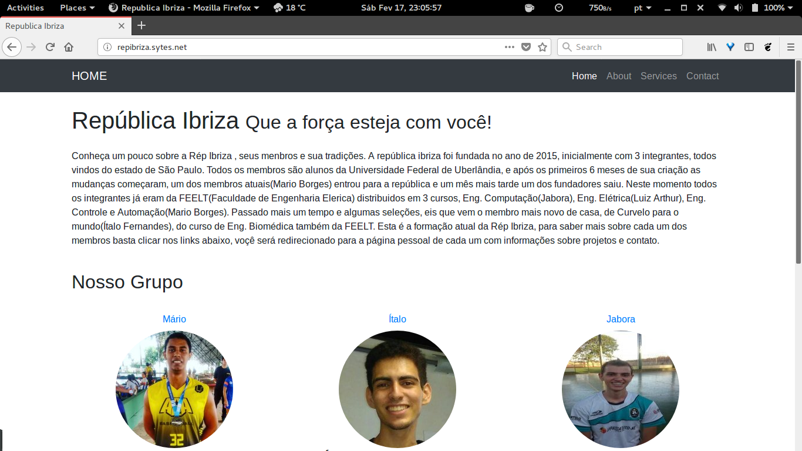

# [Denvolvimento Web - Site Ibriza](http://191.54.146.135/)

Este projeto é nosso primeiro projeto de desenvolvimento web, visando a criação de um site para a república ibriza, nele contendo um portfólio para cada morador atual.

[](https://github.com/alpinista06/Site_Ibriza/blob/master/LICENSE)

[](http://repibriza.sytes.net/)

## Download and Installation

Essa sessão está dividida em varias partes neste repositório:
* [Como configurar o servidor](docs/wiki/how_to_setup_server.md)
* [Bootstrap](https://startbootstrap.com/template-categories/all/)
* [FreeCodeCamp](https://www.freecodecamp.org/)

Tutorial da página de login:
https://www.youtube.com/watch?v=iKlWaUszxB4
https://youtu.be/-OKrloDzGpU

## License

This project is licensed under the MIT License - see the [LICENSE.md](LICENSE.md) file for details

```
"THE BEERWARE LICENSE" (Revision 42):
Italo Fernandes, Mario Borges and Luiz Henrique wrote this code.
As long as you retain this notice, you can do whatever you want with this stuff.
If we meet someday, and you think this stuff is worth it, you can buy us a beer in return.
```
## Authors

* **Mario Borges** - https://github.com/alpinista06

* **Italo Fernandes** - https://github.com/italogfernandes - italogsfernandes@gmail.com

* **Jabora** - https://github.com/jabora

See also the list of [contributors](https://github.com/alpinista06/Site_Ibriza/contributors) who participated in this project.
